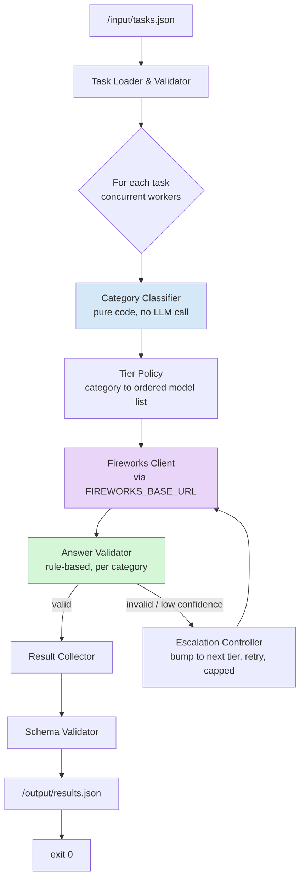
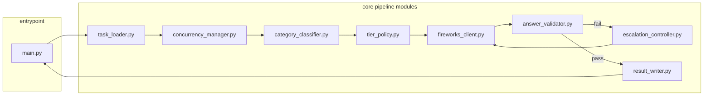
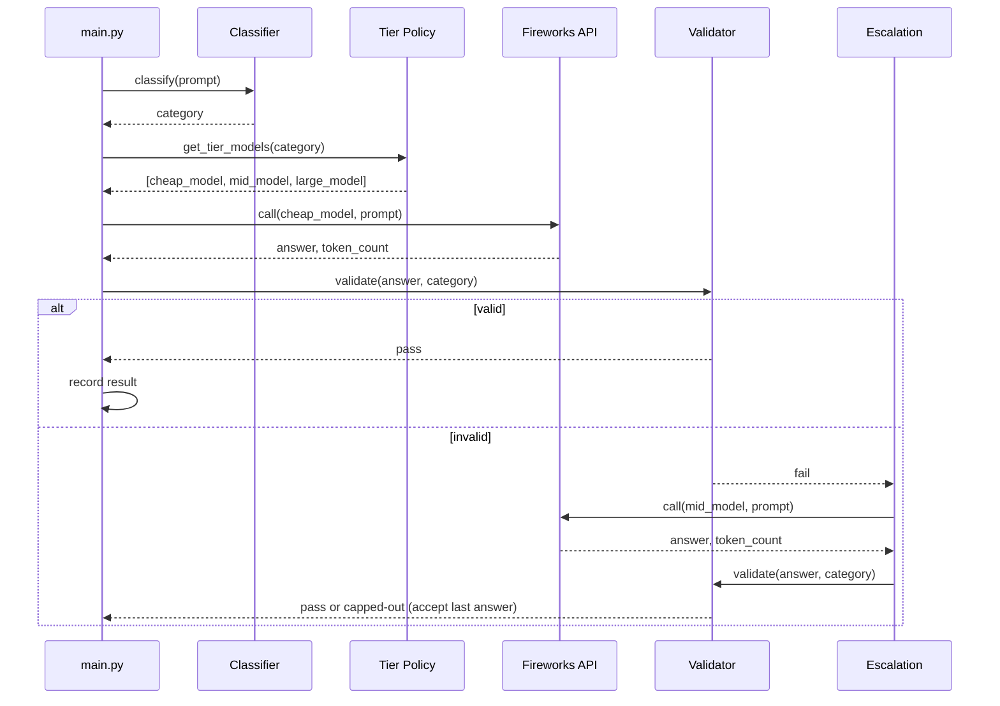
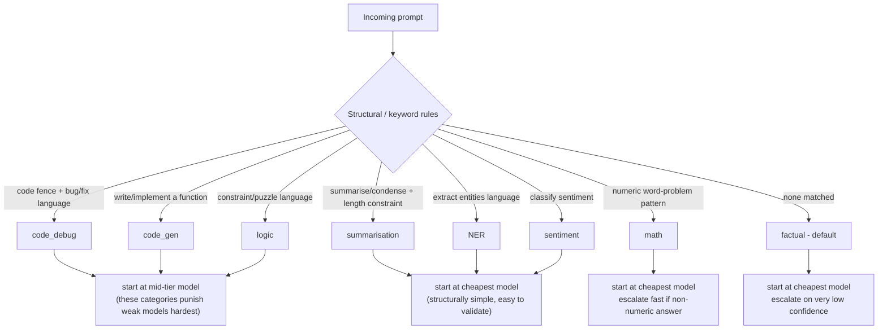

# Hybrid Token-Efficient Routing Agent
### AMD Developer Hackathon — Act II — Track 1 (General-Purpose AI Agent)

Project spec for implementation. Written to be handed directly to a code-generation tool (Antigravity) as the source of truth for architecture, module boundaries, and constraints.

---

## 1. What we are building (one sentence)

A **single Docker container that runs once as a batch job**: it reads a fixed list of tasks from a JSON file, classifies each task into one of 8 known capability categories, routes each to the **cheapest Fireworks AI model likely to answer it correctly**, validates/escalates when needed, writes all answers to an output JSON file, and exits — using as few total tokens as possible without falling below the accuracy threshold.

There is **no live service, no frontend, no dashboard, no user-facing UI** in the submitted artifact. Nobody interacts with the container while it runs. It is scored purely on: (1) does it pass the accuracy gate, and (2) among passing submissions, how few tokens did it use.

---

## 2. Hard rules and constraints (from the official Submission Guide)

These are non-negotiable. Violating any of them scores **zero**, regardless of how good the routing logic is.

### 2.1 Container contract
- **Input:** container must read tasks from `/input/tasks.json` on startup.
  ```json
  [
    { "task_id": "t1", "prompt": "Summarise the following text in one sentence: ..." },
    { "task_id": "t2", "prompt": "..." }
  ]
  ```
- **Output:** container must write results to `/output/results.json` **before exiting**.
  ```json
  [
    { "task_id": "t1", "answer": "..." },
    { "task_id": "t2", "answer": "..." }
  ]
  ```
- **Exit code:** `0` on success, non-zero on failure.
- **Malformed output JSON = automatic zero score.** Validate the schema before writing, every time.

### 2.2 Environment variables (injected by the harness at eval time — never hardcode)
| Variable | Purpose |
|---|---|
| `FIREWORKS_API_KEY` | Use this key. Never use your own. |
| `FIREWORKS_BASE_URL` | **All** Fireworks calls must go through this URL. |
| `ALLOWED_MODELS` | Comma-separated list of permitted model IDs, published on launch day. Read at runtime — never hardcode model ID strings. |

A `.env` file is fine for **local dev only**. It must **not** be bundled into the submitted image, and the code must read purely from `os.environ` at runtime.

### 2.3 Absolute constraints
- **Only Fireworks-routed inference counts.** Local models score **zero tokens** — useful only for offline dev/testing, must not appear in the live execution path of the submitted container.
- **Only models in `ALLOWED_MODELS` are permitted.** Calling any other model invalidates the whole submission.
- **No caching or hardcoding of answers.** Evaluation uses unseen prompt variants — anything that looks like memoized/cached answers is against the rules and will fail on variants anyway.
- **Max runtime: 10 minutes**, hard ceiling, for the whole container run across all tasks.
- **Max compressed image size: 10GB.** Larger images are rejected before pulling — do not bundle local LLM weights into the submitted image.
- **Submission rate limit:** 10 pushes/hour per team (this constrains your iteration workflow, not your code).

### 2.4 Scoring (two-stage)
1. **Accuracy gate:** an LLM-judge evaluates each answer against expected intent. Fall below the threshold → excluded from leaderboard entirely, regardless of token count.
2. **Token efficiency ranking:** among submissions that pass the gate, ranked **ascending by total tokens recorded by the judging proxy**. Fewer tokens wins.

**Implication:** accuracy is a pass/fail gate, not something you optimize past a certain point. Once you're comfortably above threshold, every extra token spent chasing marginal accuracy is pure downside. Spend the engineering effort on *not over-calling expensive models*, not on maximizing raw accuracy.

### 2.5 The 8 capability categories (build for all of them)
| # | Category | What it covers |
|---|---|---|
| 1 | Factual knowledge | Concepts, definitions, how things work |
| 2 | Mathematical reasoning | Multi-step arithmetic, percentages, word problems, projections |
| 3 | Sentiment classification | Label + justification |
| 4 | Text summarisation | Condense to a specific format/length constraint |
| 5 | Named entity recognition | Extract + label entities (person, org, location, date) |
| 6 | Code debugging | Find bugs, provide corrected implementation |
| 7 | Logical / deductive reasoning | Constraint puzzles, all conditions must hold |
| 8 | Code generation | Write correct, well-structured functions from spec |

---

## 3. What we are explicitly NOT building

Correcting earlier misconceptions in this project's own design history — worth stating explicitly so the code-gen tool doesn't add any of this:

- ❌ No frontend / web UI
- ❌ No API gateway or reverse proxy (there's no external traffic to gate)
- ❌ No rate limiter inside the container (the 10/hour limit is on *submissions*, not runtime requests)
- ❌ No response cache / Redis (explicitly forbidden — "do not hardcode or cache answers")
- ❌ No live local LLM (e.g. Gemma) in the execution path — local models score zero and burn runtime + image size for nothing
- ❌ No learned router trained on historical logs (there is no persistent log across runs, and prompts are unseen variants each time — nothing to train on at eval time)

A local model **may** be used purely offline, before building the final submitted image, to sanity-check your classifier/tier logic against sample prompts. It must not ship in the image or run during the timed execution.

---

## 4. High-Level Design (HLD)

Single-process batch pipeline. No external-facing components. Everything below happens inside one container run, start to finish, within the 10-minute budget.



**Key HLD properties:**
- Fully self-contained, no network dependency other than `FIREWORKS_BASE_URL`
- Concurrency (async or thread pool) is essential — with an unknown number of tasks and a fixed 10-minute ceiling, sequential calls risk timing out
- Every branch that could touch a "large/expensive" model is *reached only via escalation*, never as a default

---

## 5. Low-Level Design (LLD) — module breakdown



| Module | Responsibility | Design notes |
|---|---|---|
| `task_loader.py` | Read + validate `/input/tasks.json` | Fail loudly (non-zero exit) if malformed. Never assume schema — validate `task_id` and `prompt` exist. |
| `category_classifier.py` | Deterministic mapping: prompt → one of the 8 categories | Regex/keyword/structural rules. E.g. presence of code fence + "bug"/"fix"/"error" → `code_debug`; "write a function"/"implement" → `code_gen`; "extract"+entity nouns → `NER`; explicit "summarise/summarize" + length constraint → `summarisation`; numeric word-problem patterns → `math`; "classify the sentiment"/"positive/negative" → `sentiment`; puzzle/constraint language ("all of the following must be true") → `logic`; default → `factual`. No LLM call — must be near-instant. |
| `tier_policy.py` | category → ordered list of candidate models (cheapest first), drawn from `ALLOWED_MODELS` at runtime | Never hardcode a model ID. Build the ordered list by inspecting `ALLOWED_MODELS` naming/size conventions once published, or by config that maps "tier name" → "position in ALLOWED_MODELS", not literal strings. |
| `fireworks_client.py` | Thin wrapper around Fireworks chat completion calls | Reads `FIREWORKS_API_KEY` + `FIREWORKS_BASE_URL` from env. Handles timeouts/retries with backoff. Tracks token usage per call for local telemetry (not for caching — for your own dev-time visibility only). |
| `answer_validator.py` | Cheap, rule-based per-category sanity check | `code_debug`/`code_gen`: does the code parse (AST/syntax check)? Does it match a rough shape? `math`: does the answer contain a number, does it avoid hedge phrases like "cannot determine"? `sentiment`: is the label in the allowed set? `NER`/`summarisation`: does output roughly match requested format/length constraint? This replaces a second LLM "verifier" call wherever possible — code-based checks cost zero tokens. |
| `escalation_controller.py` | On validator fail, bump to next model tier, re-call, capped retries | Must cap retries per task (e.g. max 2 escalations) to protect the global 10-minute budget across *all* tasks, not just one. |
| `concurrency_manager.py` | Runs tasks in parallel (asyncio or thread pool) | Task count is unknown in advance — budget time defensively (e.g. estimate per-task ceiling from total tasks and time remaining). |
| `result_writer.py` | Assemble + validate final JSON schema before writing | Validate twice: once against your own schema, and structurally (`json.dumps`/`json.loads` round-trip) before the file write. Malformed output is an automatic zero. |
| `main.py` | Orchestrates the above, single entrypoint, controls overall time budget, sets exit code | Wrap everything in a top-level try/except: on any unhandled failure, still attempt to write whatever partial results exist and exit non-zero rather than hang past 10 minutes. |

---

## 6. Sequence diagram — single task lifecycle



---

## 7. Routing / tier logic (conceptual — the "decision code")

This replaces the local-LLM decision box from earlier diagram drafts. It is **pure code, zero tokens, sub-millisecond**:



**Rationale per category** (tune thresholds during your offline eval pass):
- **Code debugging / code generation / logic puzzles** are the categories most likely to fail outright on a weak model — starting one tier higher here is often *cheaper overall* than paying for a failed cheap call + escalation call.
- **Sentiment, NER, summarisation** have easily-checkable output shapes (label in a fixed set; length constraint; expected keys) — cheap models handle these well and validation is nearly free, so always start cheap.
- **Math** and **factual** start cheap by default but validation should be strict (numeric sanity check for math; length/hedge-phrase check for factual) since silent wrongness is otherwise hard to catch without a token-costly verifier call.

---

## 8. Repo / file structure to hand to Antigravity

```
.
├── Dockerfile
├── requirements.txt
├── main.py
├── config/
│   └── tier_mapping.yaml        # category -> tier position (not literal model IDs)
├── src/
│   ├── task_loader.py
│   ├── category_classifier.py
│   ├── tier_policy.py
│   ├── fireworks_client.py
│   ├── answer_validator.py
│   ├── escalation_controller.py
│   ├── concurrency_manager.py
│   └── result_writer.py
├── tests/
│   └── ... (offline unit tests, sample prompts per category)
└── dev/
    └── local_eval.py            # offline-only, not shipped in execution path;
                                  # used pre-submission to sanity-check accuracy/tokens
```

**Dockerfile requirements checklist:**
- Base image kept minimal — no GPU drivers, no local model weights, to respect the 10GB compressed limit.
- Entrypoint runs `main.py` directly (no server process, no port exposed).
- No `.env` file copied into the image — env vars are injected by the harness only.

---

## 9. Pre-submission checklist

- [ ] Container reads `/input/tasks.json` and writes `/output/results.json` exactly as specified
- [ ] Exit code `0` on success, non-zero on any unrecoverable failure
- [ ] All Fireworks calls go through `FIREWORKS_BASE_URL`, using `FIREWORKS_API_KEY` from env
- [ ] Model IDs are read from `ALLOWED_MODELS` at runtime — zero hardcoded model strings anywhere in code
- [ ] No caching layer, no memoized answers, no lookup table keyed on prompt text
- [ ] No local model / no local inference in the execution path of the submitted image
- [ ] Total runtime tested against worst-case task count, comfortably under 10 minutes
- [ ] Image compressed size checked and under 10GB
- [ ] `/output/results.json` validated as well-formed JSON matching the exact required schema
- [ ] All 8 categories covered by the classifier and have at least a default fallback path
- [ ] Escalation retries are capped — cannot runaway-loop past the time budget


AMD Track 1 rules :
AMD Developer Hackathon: Participant
Submission Guide
This document covers everything you need to build and submit a competitive entry. Exact
evaluation inputs are intentionally omitted: your agent must be genuinely capable, not
hardcoded to specific answers.

Track 1: General-Purpose AI Agent
What you are building
An AI agent that handles a wide variety of natural language tasks across multiple capability
domains, using Fireworks AI models as efficiently as possible.
Why this task exists:
Enterprises want to control AI spend without sacrificing user experience: not every task needs a
premium proprietary model. A common pattern is hosting a range of models in-house
(open-source, fine-tuned, RAG-based) and only calling out to a premium API when genuinely
necessary. Track 1 asks you to build that smart router: run as many local models as you need,
they cost zero toward your score, and make as few external Fireworks API calls as possible
while still clearing the accuracy gate.
Capability categories
Your agent will be evaluated across all eight categories. Build for all of them:
# Category What it covers
1 Factual knowledge Explaining concepts,
definitions, and how things
work

2 Mathematical reasoning Multi-step arithmetic,
percentages, word problems,
projections

3 Sentiment classification Labelling sentiment and
justifying the classification

JSON

JSON
# Category What it covers
4 Text summarisation Condensing passages to a
specific format or length
constraint

5 Named entity recognition Extracting and labelling
entities (person, org, location,
date)

6 Code debugging Identifying bugs in code
snippets and providing
corrected implementations

7 Logical / deductive
reasoning

Constraint-based puzzles
where all conditions must be
satisfied
8 Code generation Writing correct,

well-structured functions from
a spec

What to submit
A Docker image pushed to a public registry (e.g. GitHub Container Registry, Docker Hub).
Check out the Image Architecture requirement at the bottom of this document
Your container must:
1. Read tasks from /input/tasks.json on startup

[
{ "task_id": "t1", "prompt": "Summarise the following text in one sentence: ..."
},
{ "task_id": "t2", "prompt": "..." }
]

2. Write results to /output/results.json before exiting

[
{ "task_id": "t1", "answer": "..." },

JSON

Python
{ "task_id": "t2", "answer": "..." }
]

Practice tasks (not the real evaluation set)
These are illustrative examples only — not the real grading tasks (those stay hidden). Use them
to validate your container's input/output handling locally before using a real submission slot.

[
{ "task_id": "practice-01", "prompt": "What is the capital of Australia, and
what body of water is it near?" },
{ "task_id": "practice-02", "prompt": "A store has 240 items. It sells 15% on
Monday and 60 more on Tuesday. How many items remain?" },
{ "task_id": "practice-03", "prompt": "Classify the sentiment of this review:
The battery life is great, but the screen scratches too easily." },
{ "task_id": "practice-04", "prompt": "Summarize the following in exactly one
sentence: [your own sample paragraph here]." },
{ "task_id": "practice-05", "prompt": "Extract all named entities and their
types from: Maria Sanchez joined Fireworks AI in Berlin last March." },
{ "task_id": "practice-06", "prompt": "This function should return the max of a
list but has a bug: def get_max(nums): return nums[0]. Find and fix it." },
{ "task_id": "practice-07", "prompt": "Three friends, Sam, Jo, and Lee, each own
a different pet: cat, dog, bird. Sam does not own the bird. Jo owns the dog. Who
owns the cat?" },
{ "task_id": "practice-08", "prompt": "Write a Python function that returns the
second-largest number in a list, handling duplicates correctly." }
]

Environment variables:
The harness injects these at runtime. Read them from the environment: do not hardcode values
or bundle a .env file in your image.

import os

api_key = os.environ["FIREWORKS_API_KEY"] # provided by harness — do not use
your own
base_url = os.environ["FIREWORKS_BASE_URL"] # route ALL Fireworks calls through
this URL
models = os.environ["ALLOWED_MODELS"].split(",") # exact model IDs published
on launch day

For local development you can use a .env file, but your submitted container must read these
purely from the environment: the harness will inject the real values at evaluation time.
Variable Description
FIREWORKS_API_KEY Provided by the harness — use this key, not

your own

FIREWORKS_BASE_URL Base URL for all Fireworks API calls — must

be used to configure your client

ALLOWED_MODELS Comma-separated list of permitted Fireworks
AI model IDs, published on launch day
Important: All API calls must go through FIREWORKS_BASE_URL. Calls that
bypass this URL will not be recorded and the submission will score zero tokens. Do
not hardcode model IDs: read from ALLOWED_MODELS at runtime.
Rules
- Exit code 0 on success, non-zero on failure
- Maximum runtime: 10 minutes
- Only models in ALLOWED_MODELS are permitted, calls to other models invalidate the
submission
- /output/results.json must be valid JSON, malformed output scores zero
- Local models and tokens used locally count as zero for the final score; all Fireworks
API calls must go through FIREWORKS_BASE_URL; local model inference inside the
container is permitted and counts toward accuracy, but not toward the token score.
- Do not hardcode or cache answers; evaluation uses unseen prompt variants
- Image compressed size must not exceed 10GB — larger images are rejected before
pulling
- Submissions are rate-limited to 10 per hour per team

- Grading environment: 4 GB RAM, 2 vCPU. If bundling a local model, size it to fit within
these limits (2B–3B 4-bit quantized models are safe; 7B 4-bit fills the full RAM budget,
leaving no room for agent code).
Scoring
1. Accuracy gate: LLM-Judge evaluates each answer against the expected intent.
Submissions below the accuracy threshold are excluded from the leaderboard.
2. Token efficiency: submissions that pass the accuracy gate are ranked ascending by
total tokens recorded by the judging proxy. Fewer tokens = higher rank.
A note on token counting: The underlying task prompts are identical for every team, but your
own system prompt (verbosity instructions, formatting requests, etc.) affects your input token
count, and your model's response length affects output tokens. Don't over-optimize output
length early, focus first on your routing logic and which local models you use. Output-length
tuning is a good later-stage optimization once your router is solid.

Troubleshooting: why did my submission fail?
If your submission doesn't score as expected, here's what each status means and how to fix it.
Most of these also apply to Track 2.
Status What it means & how to fix it
PULL_ERROR We couldn't pull your Docker image. Confirm
it's public, and includes a linux/amd64
manifest (Apple Silicon builds need docker
buildx build --platform linux/amd64).
RUNTIME_ERROR Your container ran but exited with a non-zero
error code. Check your own container logs
locally — something in your agent code
crashed.

TIMEOUT Your container didn't finish within the
10-minute limit. Check for hangs, infinite
loops, or excessive retries in your agent.
OUTPUT_MISSING Your container exited cleanly but never wrote
/output/results.json. Confirm your code writes
this file before exiting.

INVALID_RESULTS_SCHEMA /output/results.json isn't in the right format.
Each entry must be a JSON object with both

a task_id and an answer field.

MODEL_VIOLATION You called a Fireworks model that isn't in the
published ALLOWED_MODELS list. Only call
models from that list, read it from the env var
at runtime, don't hardcode it.

IMAGE_TOO_LARGE Your image is over the 10 GB compressed

size limit. Trim unnecessary
layers/dependencies from your Docker
image.

ACCURACY_GATE_FAILED Your container ran fine, but your answers
scored below the accuracy threshold. This is
a quality issue with your agent's answers, not
an infrastructure problem.

Note: you may also see a flagged: ZERO_API_CALLS marker alongside your result; this is not
a failure. It just means your submission made zero calls through the Fireworks proxy (e.g. a
local-model-only agent), which is a valid strategy per the local models rule above.